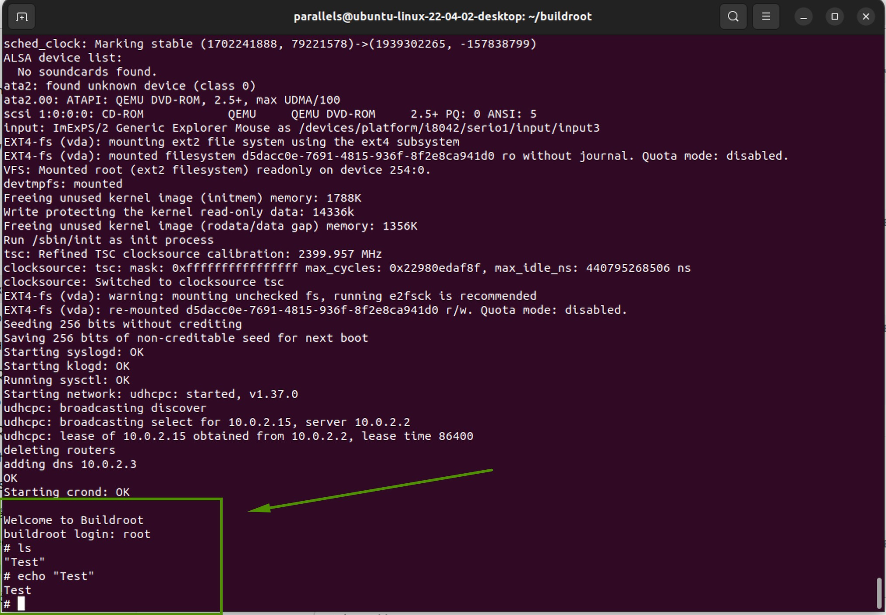
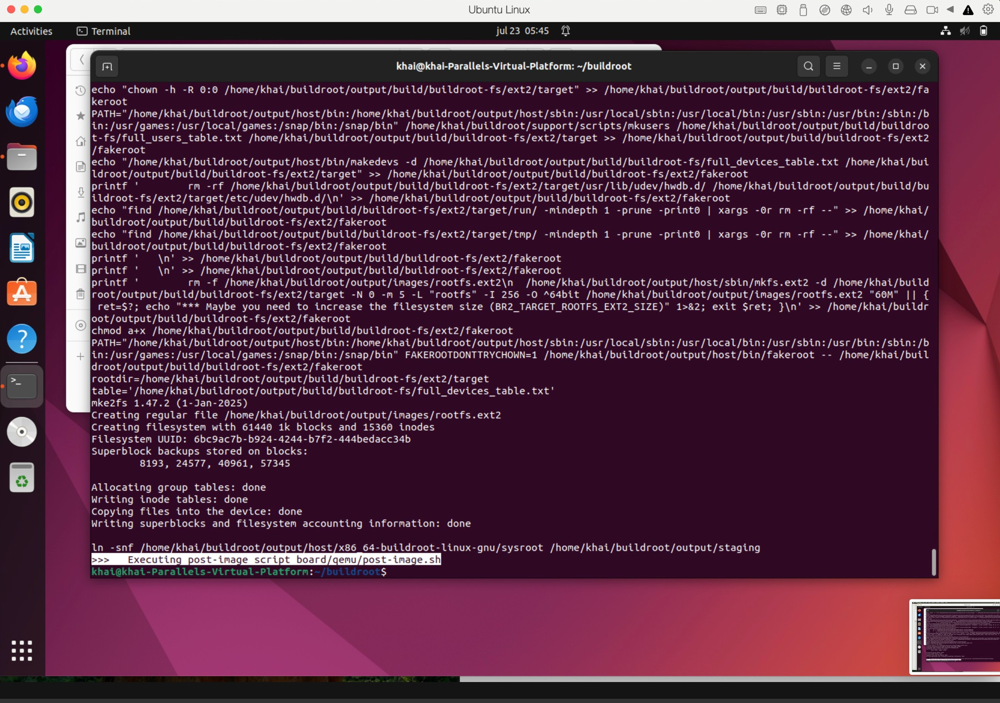
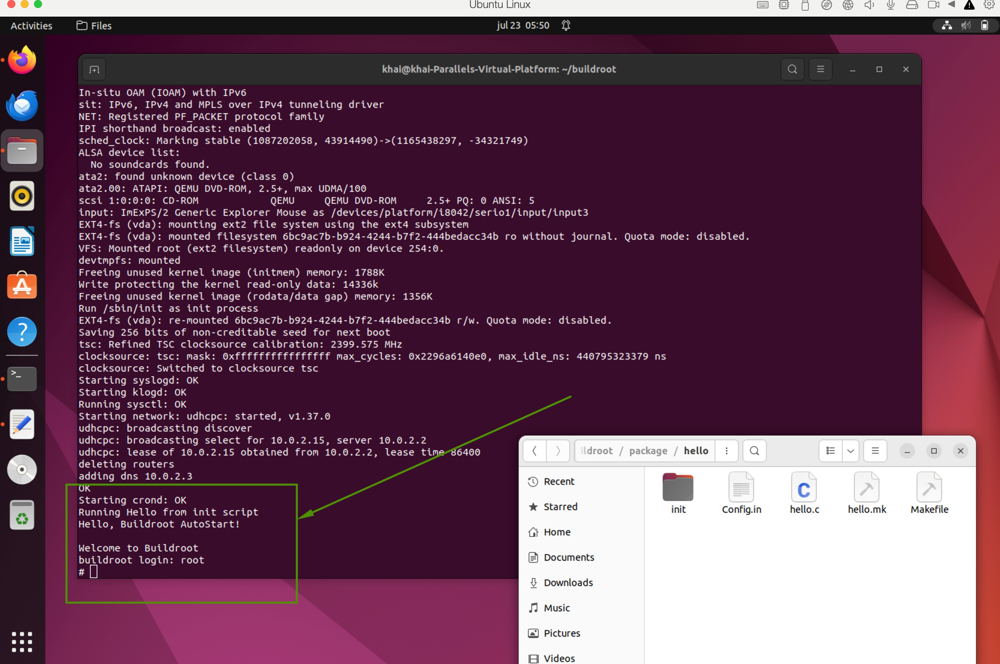

_**Interview output of PHAN QUANG KHAI:**_

# Buildroot x86_64 Linux System with Auto-starting Hello World

This project demonstrates how to build a minimal x86_64 Linux system using Buildroot that boots in QEMU and automatically runs a custom "Hello World" C program at startup.

---

## 🔧 I) Basic Part

### 1. Clone Buildroot

```bash
git clone https://github.com/buildroot/buildroot.git
cd buildroot
```

### 2. Configure for x86_64

```bash
make qemu_x86_64_defconfig
```

### 3. (Optional) Check/Customize via menuconfig

```bash
make menuconfig
```
Make sure:
- Architecture: `x86_64`
- BusyBox is enabled
- Enable compiler cache for faster rebuilds (optional)

### 4. Build the system

```bash
make
```

This step may take ~15–30 minutes.

### 5. Run in QEMU

```bash
output/images/start-qemu.sh
```

You should see the Linux system boot and reach a shell with:
```
Welcome to Buildroot
buildroot login: root
```

---

### OUTPUT of BASIC PART:


---
## 🚀 II) Advanced Part

### 1. Create Hello World Package

```bash
mkdir -p package/hello/init
```

#### hello.c — `package/hello/hello.c`

```c
#include <stdio.h>

int main() {
    printf("Hello, Buildroot AutoStart!\n");
    return 0;
}
```

#### Config.in — `package/hello/Config.in`

```make
config BR2_PACKAGE_HELLO
    bool "Hello World Program"
```

#### hello.mk — `package/hello/hello.mk`

```make
HELLO_VERSION = 1.0
HELLO_SITE = $(TOPDIR)/package/hello
HELLO_SITE_METHOD = local
HELLO_LICENSE = Public Domain

define HELLO_BUILD_CMDS
	$(TARGET_CC) $(TARGET_CFLAGS) -o $(@D)/hello $(@D)/hello.c
endef

define HELLO_INSTALL_TARGET_CMDS
	$(INSTALL) -D -m 0755 $(@D)/hello $(TARGET_DIR)/usr/bin/hello
	$(INSTALL) -D -m 0755 $(TOPDIR)/package/hello/init/hello.init $(TARGET_DIR)/etc/init.d/S99hello
endef

$(eval $(generic-package))

```

#### hello.init — `package/hello/init/hello.init`

```sh
#!/bin/sh
echo "Running Hello from init script"
/usr/bin/hello
```

Make sure it is executable:

```bash
chmod +x package/hello/init/hello.init
```

### 2. Register the Package

Edit `package/Config.in` and add at the end:

```make
source "package/hello/Config.in"
```

### 3. Enable in menuconfig

```bash
make menuconfig
```
Navigate to:
- `Target packages`
  - Mark `[ * ] Hello World Program`

### 4. Build Again

```bash
make
```

### 5. Boot and Test

```bash
output/images/start-qemu.sh
```

Expected output:

```
Running Hello from init script
Hello, Buildroot AutoStart!
```

---
### Build of Advanced successfully at step 4:

---
### OUTPUT of Advanced PART at step 5:


---
## ✅ Summary

| Feature                            | Status |
|-----------------------------------|--------|
| Build x86_64 with Buildroot        | ✅     |
| Boot in QEMU with shell access     | ✅     |
| Write Hello World in C             | ✅     |
| Auto-start Hello at boot           | ✅     |

---

## 📤 Structure: 
```
buildroot/
├── package/
│   ├── Config.in
│   ├── hello/
│   │   ├── hello.c
│   │   ├── hello.mk
│   │   ├── Config.in
│   │   └── init/
│   │       └── hello.init
```


